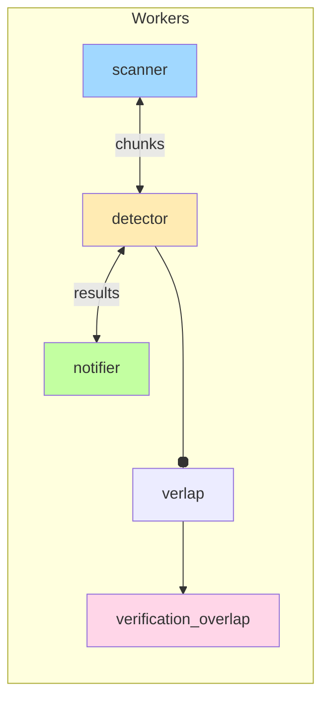

# Figma Benchmark Toolkit

_Introduced in branch **figma-benchmark-upstream-merge**_

This document explains the **pipeline-benchmark script** (`benchmarks/benchmark_figma.go`) that was added to profile TruffleHog's performance against the Figma GitHub organisation. It covers what the script does, how it collects metrics, the structure of its JSON output, and how you can run or extend it.

---

## 1  What is `benchmark_figma.go`?

Location: [`benchmarks/benchmark_figma.go`](../../benchmarks/benchmark_figma.go)

Goals:
1. Stress-test the **entire scanning pipeline** (input → decode → detector → verification → notifier).
2. Export **Prometheus metrics** while the scan is running.
3. Perform an **offline analysis** immediately after the scan to surface bottlenecks.
4. Save a self-contained **JSON report** you can diff between runs or feed into charting scripts.

---

## 2  High-Level Flow

```mermaid
sequenceDiagram
    participant 🏁 as start
    participant 🐹 as benchmark_figma.go
    participant 📈 as Prometheus (localhost:2112)
    participant 🔍 as TruffleHog binary
    participant 💾 as JSON report

    🏁->>🐹: launch
    activate 🐹
    ▷ 🐹-->>📈: start /metrics HTTP server
    🐹->>🔍: exec ../trufflehog github --org=figma --json --concurrency=16 …
    activate 🔍
    🔍-->>📈: emit runtime metrics (gauges, histograms…)
    ⏳ Note over 🔍,📈: cloning + scanning repos (can be lengthy)
    🔍-->>🐹: stream JSON findings
    deactivate 🔍
    🐹->>📈: query metrics API (analysis phase)
    🐹->>💾: save `trufflehog_pipeline_benchmark_<timestamp>.json`
    deactivate 🐹
```

---

## 3  Key Script Sections (annotated)

### 3.1  Spin-up Prometheus handler
```go
// benchmarks/benchmark_figma.go
http.Handle("/metrics", promhttp.Handler())
log.Printf("Prometheus metrics available at http://localhost:2112/metrics")
go http.ListenAndServe(":2112", nil)
```
Starts a lightweight HTTP server so the TruffleHog instance can scrape its own metrics _locally_ (no external Prometheus needed).

### 3.2  Launch TruffleHog scan
```go
cmd := exec.Command("../trufflehog", "github",
    "--org=figma",
    "--no-update",
    "--concurrency=16",
    "--json",
    "--no-only-verified",
)
output, _ := cmd.CombinedOutput()
```
Runs the **cached** TruffleHog binary one directory up, with aggressive concurrency and JSON streaming turned on. The raw JSON lines are captured for later repo-counting.

### 3.3  Metrics analysis phase
```go
client, _ := api.NewClient(api.Config{Address: "http://localhost:2112"})
results := &BenchmarkResults{}
results.OverallThroughputMBps = queryGauge("trufflehog_overall_throughput_bytes_per_second") / (1024*1024)
results.PipelineBottlenecks = analyzePipelineBottlenecks(ctx, v1api)
// … plus concurrency, detector latency, system usage
```
Immediately after the scan, the script queries the in-memory Prometheus registry to compute:
* Channel utilisation & blocked writes
* Worker utilisation / starvation
* Detector latency top-n
* Memory / GC stats

### 3.4  Persist report
```go
filename := fmt.Sprintf("trufflehog_pipeline_benchmark_%s.json", time.Now().Format("2006-01-02_15-04-05"))
json.NewEncoder(file).Encode(results)
```
Stores everything in a timestamped JSON file in `benchmarks/`.

---

## 4  Report Schema (excerpt)

```jsonc
{
  "scan_duration": "1h23m45s",
  "total_repositories": 123,
  "overall_throughput_mbps": 11.4,
  "pipeline_bottlenecks": [
    {"stage": "detectable_chunks", "channel_utilization_percent": 92, …},
    {"stage": "verification_overlap", "blocked_writes_per_second": 14, …}
  ],
  "concurrency_metrics": {
    "worker_utilization_percent": {"detector": 87.5, "notifier": 22.0},
    "concurrency_efficiency_percent": 68.4
  },
  "top_slow_detectors": [
    {"detector_name": "aws-secret-key", "average_latency_ms": 732, …}
  ],
  "system_resource_usage": {"peak_memory_usage_mb": 792, …},
  "recommendations": ["🔧 CRITICAL: Detector workers are saturated…"]
}
```

---

## 5  Running the Benchmark

```bash
# From repo root – ensure you've built trufflehog first
CGO_ENABLED=0 go build -o trufflehog .

# Run the benchmark (writes JSON & logs to benchmarks/)
(cd benchmarks && go run benchmark_figma.go)
```

Requirements:
* Go 1.22+ to compile the helper script
* Network access for GitHub cloning & verification calls

---

## 6  Extending / Customising

| Want to… | How |
|----------|-----|
| Scan a different org | Change `--org=figma` flag in the `exec.Command` list |
| Change concurrency | Edit `--concurrency` value (affects worker multipliers) |
| Disable verification to isolate regex cost | Add `--no-verification` to the TruffleHog args |
| Visualise results | Feed the output JSON into the upcoming Python plotting script (or recreate with Matplotlib/Seaborn) |

---

## 7  Diagrams for Mental Model



---

### TL;DR
Run the Go script ➜ it spins up its own Prometheus ➜ TruffleHog emits metrics ➜ script queries them ➜ saves a detailed JSON report _(plus prints a pretty console table)_.

Use these benchmarks to spot throughput regressions, detector hot-spots, and channel bottlenecks **without deploying a full Prometheus stack**.

---

<div align="right">— Generated for Figma Benchmark branch</div>