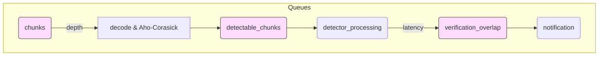

# Pipeline Metrics Added in `figma-benchmark-upstream-merge`

_Comparison: **upstream/main ➜ figma-benchmark-upstream-merge**_

This document highlights the Prometheus metrics introduced (or significantly expanded) in the **figma-benchmark** branch, explains their purpose, and shows where in the code they are wired into the scanning pipeline.

---

## 1  What Changed?

A diff between branches shows nearly **all performance instrumentation was added in two files**:

| File | Δ Lines | Purpose |
|------|---------|---------|
| [`pkg/engine/metrics.go`](../../pkg/engine/metrics.go) | +500-ish | Defines new gauges / histograms / counters, wraps them in helper functions |
| [`pkg/engine/engine.go`](../../pkg/engine/engine.go)   | +150-ish | Inserts calls (`RecordPipelineStage`, `RecordChannelQueueDepth`, etc.) at critical points in the worker goroutines |

*(Run `git diff --stat upstream/main..HEAD -- pkg/engine/*metrics*` to inspect the exact additions.)*

---

## 2  New Metric Families

| Metric name (prefix: `trufflehog_…`) | Type | Why it matters |
|--------------------------------------|------|----------------|
| `chunks_channel_queue_depth`<br>`detectable_chunks_channel_queue_depth`<br>`verification_overlap_channel_queue_depth`<br>`results_channel_queue_depth` | **Gauge** | Live backlog per internal queue → reveals saturated stages  |
| `active_workers{worker_type}` | **Gauge** | Scanner / detector / verifier / notifier parallelism in real time |
| `worker_wait_time_microseconds{worker_type}` | **Histogram** | Time workers spend idle – helps tune concurrency |
| `channel_blocked_writes_total{channel}` | **Counter** | How often writers block – direct bottleneck signal |
| `stage_latency_microseconds{stage}` | **Histogram** | Per-stage latency for chunks (decode, detector, notification, …) |
| `pipeline_end_to_end_latency_milliseconds` | **Histogram** | Chunk lifetime from ingress to result emission |
| `detector_execution_time_microseconds{detector}` | **Histogram** | Regex+verification latency per detector type |
| `detector_chunks_processed_total{detector}` | **Counter** | Detector throughput benchmark |
| `verification_latency_milliseconds{detector,result}` | **Histogram** | Network RTT for verification APIs |
| `overall_throughput_bytes_per_second` | **Gauge** | Global scan throughput figure |
| System gauges: `memory_usage_bytes`, `goroutines_total`, `gc_pause_time_microseconds` | **Gauge / Histogram** | Runtime health checks |

> **All of the above are _new or greatly expanded_ vs. upstream/main**.

---

## 3  How They're Wired In

### 3.1  Channel Depth & Workflow Bottlenecks

```go
// engine.go – scanner worker (decode + aho-corasick)
if len(e.detectableChunksChan) > cap(e.detectableChunksChan)*3/4 {
    RecordChannelBlocked("detectable_chunks")
}
RecordChannelQueueDepth("detectable_chunks", len(e.detectableChunksChan))
```

This snippet emits:
*Back-pressure counter* `channel_blocked_writes_total{channel="detectable_chunks"}` when writers stall, and
*Depth gauge* `detectable_chunks_channel_queue_depth` every time a chunk is en-queued.

### 3.2  Stage Latency

```go
workerStart := time.Now()
// … do detector work …
RecordPipelineStage("detector_processing", time.Since(workerStart))
```

Records a histogram sample in `stage_latency_microseconds{stage="detector_processing"}` per chunk.

### 3.3  Detector Execution Profiling

```go
RecordDetectorExecution(detectorName, data.chunk.Verify, detectorDuration)
```

Populates both latency and throughput counters for each detector implementation.

### 3.4  System Telemetry & Throughput

`UpdateThroughputMetrics()` and `RecordSystemMetrics()` are invoked periodically in the notifier worker, pushing overall throughput as well as memory / goroutine counts.

---

## 4  Visual Model



* Pink nodes = queues we gauge (`*_channel_queue_depth`).<br>
* Blue nodes = stages we time (`stage_latency_microseconds`).

---

## 5  Quick Start Tips

1. **Grafana Dashboard**
   * Import Prometheus as a data-source; query the gauge/histogram names above.
   * Alert when `channel_blocked_writes_total` increases or queue depth > 80 %.
2. **Benchmark Script Integration**  
   `benchmarks/benchmark_figma.go` already fetches many of these metrics directly from Prometheus and saves a JSON report.
3. **Detector Optimisation**  
   Sort `detector_execution_time_microseconds` by average latency to spot slow regexes/APIs.

---

<div align="right">Generated automatically → Figma Benchmark branch</div>