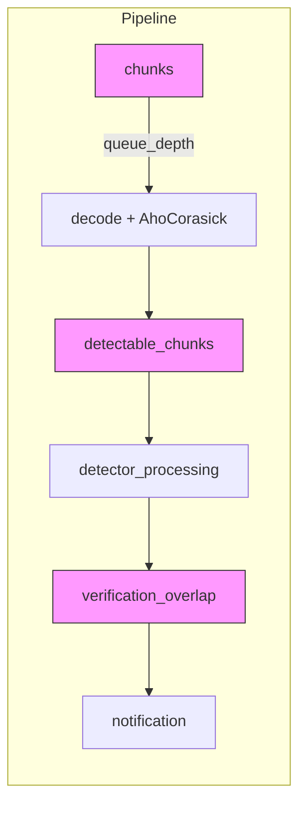

# TruffleHog Pipeline Metrics – Figma Benchmark Branch

> _A high-level guide to the new Prometheus metrics that expose **where the scanner spends its time**._

---

## 1  Key Source Files

| File | Purpose |
|------|---------|
| [`pkg/engine/metrics.go`](../../pkg/engine/metrics.go) | **Metric definitions & helpers** – declares all Prometheus gauges, counters & histograms and exposes helper functions (`RecordPipelineStage`, `RecordChannelQueueDepth`, …) |
| [`pkg/engine/engine.go`](../../pkg/engine/engine.go) | **Instrumentation** – calls the helpers from each worker goroutine (scanner, detector, notifier) to record live metrics during a scan |

> Tip: use `grep "RecordPipelineStage(" -n pkg/engine/engine.go` to jump to each call-site.

---

## 2  Metric Families

| Metric | Type | What it tells you |
|--------|------|-------------------|
| `trufflehog_<stage>_channel_queue_depth` | Gauge | Real-time backlog in each pipeline queue (input chunks, detector backlog, verification overlap, results) – _hotspot for bottlenecks_ |
| `trufflehog_active_workers{worker_type=…}` | Gauge | Concurrent goroutines working per pool (scanner / detector / verification / notifier) |
| `trufflehog_worker_wait_time_microseconds` | Histogram | How long a worker sat idle – high values → over-provisioned workers or upstream starvation |
| `trufflehog_stage_latency_microseconds{stage=…}` | Histogram | Time a unit of work spends **inside** an individual stage |
| `trufflehog_pipeline_end_to_end_latency_milliseconds` | Histogram | End-to-end latency from chunk input ➜ secret output |
| `trufflehog_detector_execution_time_microseconds{detector,…}` | Histogram | Combined regex + verification latency per detector |
| `trufflehog_detector_chunks_processed_total{detector}` | Counter | Throughput (incremented per processed chunk) |
| `trufflehog_verification_latency_milliseconds` | Histogram | Network verification RTTs – surface slow APIs |
| `trufflehog_overall_throughput_bytes_per_second` | Gauge | Global scan throughput |
| `trufflehog_memory_usage_bytes`, `trufflehog_goroutines_total`, `trufflehog_gc_pause_time_microseconds` | Gauges / Histogram | JVM-style system telemetry – memory, goroutine count, GC pauses |

---

## 3  Annotated Code Snippets

*Metric declaration (excerpt from `metrics.go`)*
```go
// Channel backlog
chunksChannelQueueDepth = promauto.NewGauge(prometheus.GaugeOpts{
    Name: "trufflehog_chunks_channel_queue_depth",
    Help: "Current number of chunks waiting in the input channel",
})

// Stage latency
stageLatency = promauto.NewHistogramVec(prometheus.HistogramOpts{
    Name:    "trufflehog_stage_latency_microseconds",
    Help:    "Processing time for each pipeline stage",
    Buckets: prometheus.ExponentialBuckets(10, 2, 20),
}, []string{"stage", "detector"})
```

*Instrumentation call-site (excerpt from `engine.go`)*
```go
workerStartTime := time.Now()
RecordWorkerActivity("detector", true)

// … regex & verification work …

workerActiveTime := time.Since(workerStartTime)
RecordPipelineStage("detector_processing", workerActiveTime)
RecordWorkerActivity("detector", false)
```

These two lines connect the **detector worker**'s runtime directly to Prometheus. Similar calls exist in the scanner and notifier workers.

---

## 4  How the Metrics Fit Together



> _Blue boxes_ represent pipeline stages; **pink boxes** are the queues we measure with `*_channel_queue_depth`.

---

## 5  Interpreting the Metrics

1. **Bottleneck hunting**  
   • If `*_channel_queue_depth` keeps growing while worker utilisation is high → that stage is saturated.  
   • If queue depth is low but worker wait-time is high → upstream starvation.
2. **Detector hot-spots**  
   Use `trufflehog_detector_execution_time_microseconds` to rank slow detectors; exclude or optimise the worst offenders.
3. **Verification latency**  
   High `verification_latency_milliseconds` suggests throttling or network issues with external APIs.
4. **Throughput & resources**  
   Monitor `overall_throughput_bytes_per_second`, memory, goroutine count to ensure global health.

---

## 6  Next Steps

* Hook up **Grafana** to Prometheus using these metric names for real-time dashboards.
* Feed the metrics into the existing benchmark script (`benchmarks/benchmark_figma.go`) – the JSON it writes already summarises the top bottlenecks.
* Use the visualisation script (once available) to produce historical PNG snapshots for regression tracking.

<div align="right">— End of Report</div>